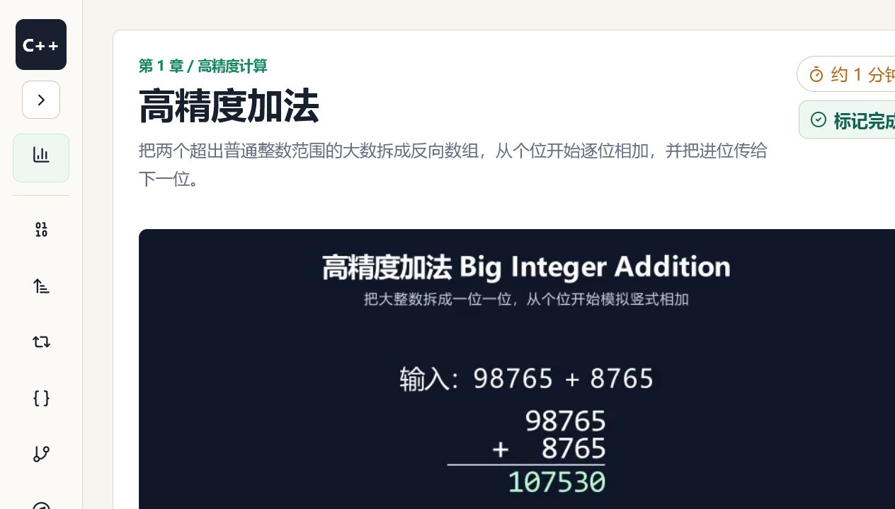
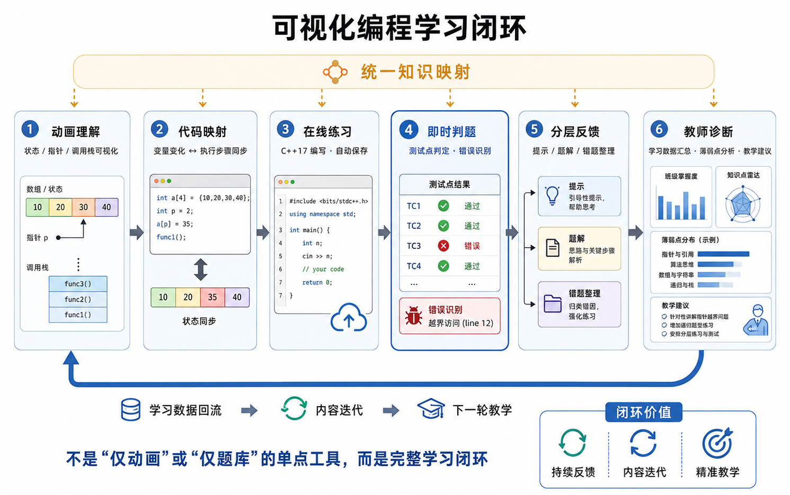
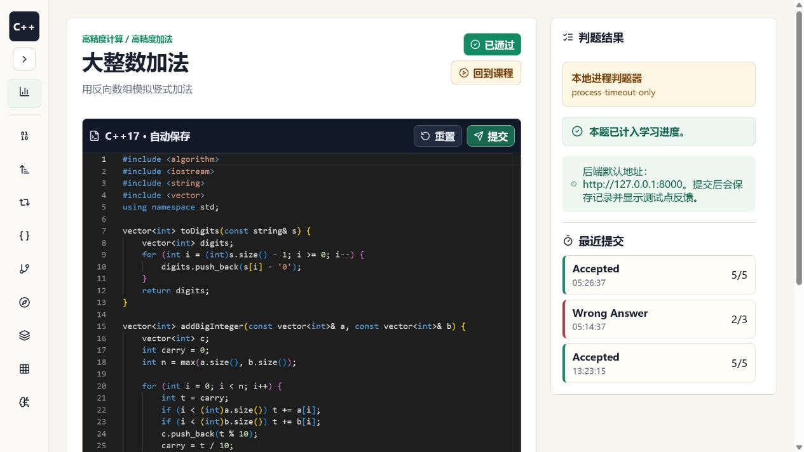
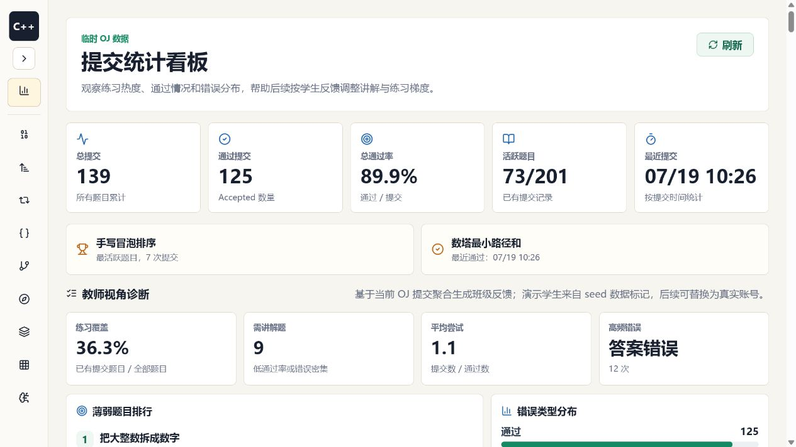
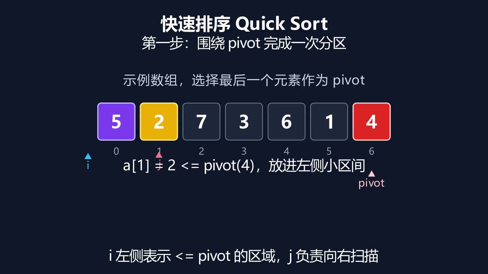
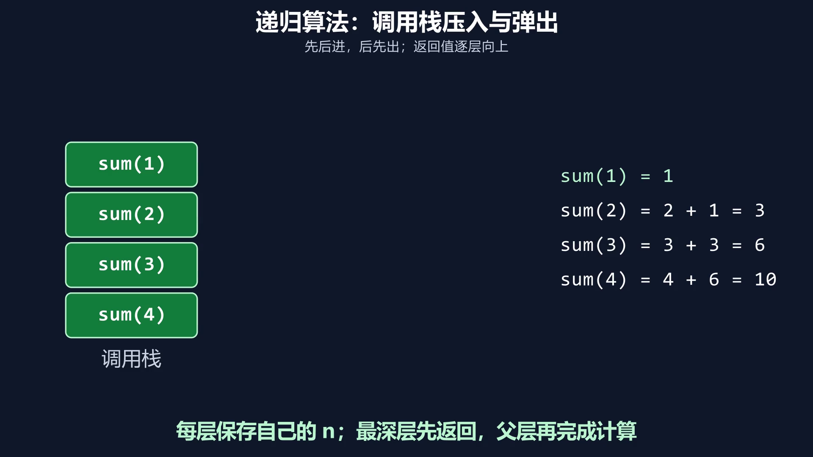
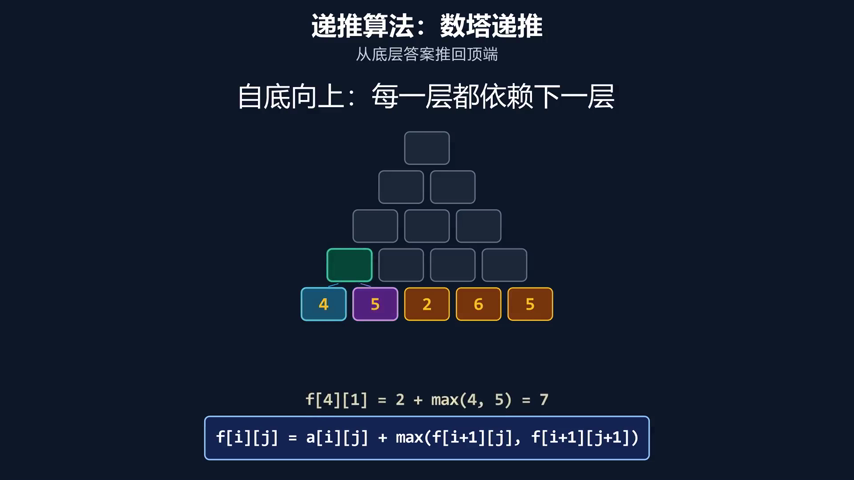
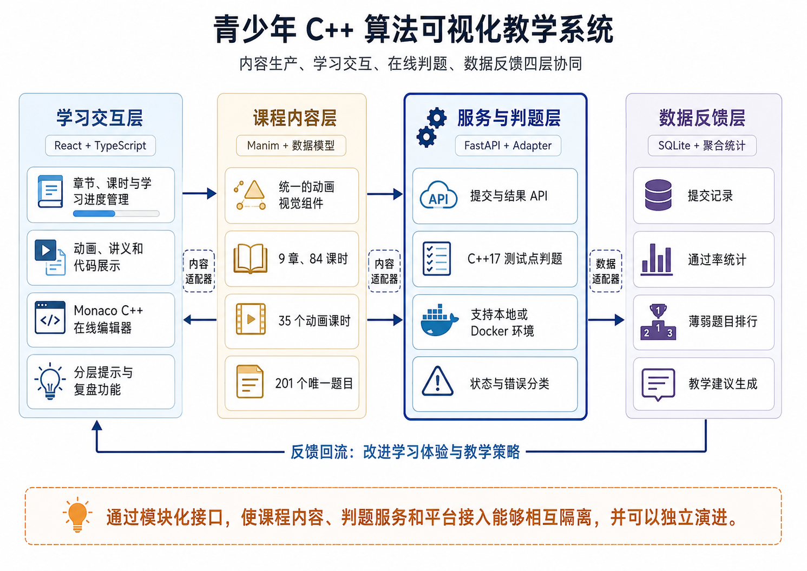

<div align="center">

# 青少年 C++ 算法可视化教学系统

### 让抽象算法“看得见、写得出、练得会”，让学习数据真正回到教学现场

**比赛参赛项目 · 可运行全栈 MVP · 面向青少年信奥与算法入门教学**


</div>



> 这不是一个“动画素材库”，也不是一个“在线题库”。项目把 **算法动画、C++ 代码映射、在线练习、即时判题、分层反馈和教师诊断** 连成同一条学习闭环，让学生从“看懂”真正走到“会写”，也让教师知道下一步该讲什么。

## 30 秒看懂项目

| 已落地规模 | 学习闭环 | 参赛价值 |
| --- | --- | --- |
| **9** 个算法章节 · **84** 个课时 · **201** 个唯一题目 | 动画理解 → 代码映射 → 在线练习 → 即时判题 → 分层反馈 → 教师诊断 | 不是概念方案：前端、后端、动画、判题和数据看板均可本地运行 |
| **35** 个课时已接入 Manim 动画 | 题目 Accepted 自动计入学习进度，提交数据回流教师看板 | 统一动画模板与 Judge Adapter 支持规模化扩展和平台接入 |
| **7** 章 ready，**2** 章持续建设 | 视频、讲义、示例、练习与复盘在同一课程路径中完成 | 同时解决“算法难理解”和“内容难规模化生产”两类问题 |

## 核心创新：同一知识点的全链路一致映射



### 1. 从“播放动画”升级为“可交互学习闭环”

动画中的数组格、指针、调用栈、状态转移和递归树，不停留在视觉演示层；它们继续映射到 C++ 变量、循环边界、测试点和练习任务。学生可以沿同一路径完成理解、编码、提交和复盘。

### 2. 用标准化动画组件降低课程生产成本

项目抽象了统一主题、数组单元格、指针、高亮和状态展示组件。课程脚本、Manim 场景、预览图和前端课时数据采用稳定命名与目录约定，降低新增算法动画的重复劳动，使内容生产从“逐条手工制作”走向“模板化扩展”。

### 3. 分层反馈避免“直接看答案”

练习支持逐层提示、题解要点和常见错误：先提示思路，再定位关键变量与边界，最后才进入核心实现。它把“卡住”和“抄答案”之间补上了教学支架，更适合青少年逐步建立算法表达能力。

### 4. 学习数据反向驱动教学

教师看板聚合提交数、通过率、薄弱题目、错误类型和平均尝试次数，并给出下一次课的关注建议。系统由此形成“内容—学习—数据—迭代”的闭环，而不是单向输出课程。

## 真实运行界面

<table>
  <tr>
    <td width="50%"></td>
    <td width="50%"></td>
  </tr>
  <tr>
    <td align="center"><b>学生端：</b>C++17 编辑、自动保存、提交、测试点与历史结果</td>
    <td align="center"><b>教师端：</b>通过率、薄弱题、错误分布与教学建议</td>
  </tr>
</table>

更多算法动画预览：

<p align="center">
  
  
  
</p>

## 系统架构



核心工程设计：

- 前端使用 React + TypeScript + Vite，提供课程导航、进度、视频、讲义、练习和统计看板。
- 后端使用 FastAPI，提供提交、判题、历史记录、统计和健康检查接口。
- 判题器通过 `JudgeService -> LocalJudge / DockerJudge` 适配，便于从本地演示平滑迁移到隔离沙箱。
- SQLite 记录提交并生成聚合统计；浏览器本地状态为后端不可用场景提供兜底。
- Manim 负责算法动画生产，公共主题和组件保证跨章节视觉一致性。

## 课程覆盖

以下数据由当前 `curriculum.ts` 实际配置统计，不含规划中的空壳数据。

| 章 | 主题 | 状态 | 课时 | 练习 | 已接入动画 |
| ---: | --- | :---: | ---: | ---: | ---: |
| 1 | 高精度计算 | ✅ ready | 11 | 33 | 11 |
| 2 | 数据排序 | ✅ ready | 6 | 18 | 6 |
| 3 | 递推算法 | 🚧 building | 9 | 27 | 9 |
| 4 | 递归算法 | ✅ ready | 9 | 27 | 9 |
| 5 | 搜索与回溯 | 🚧 building | 10 | 20 | 0 |
| 6 | 贪心算法 | ✅ ready | 10 | 20 | 0 |
| 7 | 分治算法 | ✅ ready | 8 | 16 | 0 |
| 8 | 广度优先搜索 | ✅ ready | 9 | 18 | 0 |
| 9 | 动态规划 | ✅ ready | 12 | 24 | 0 |
| **合计** |  | **7 ready / 2 building** | **84** | **203*** | **35** |

\* 203 为各课时中的练习引用数；去重后为 **201 个唯一题目 ID**。其中 `big-integer-factorial-small` 与 `greedy-coin-greedy-vs-optimal` 被不同课时复用。

其中高精度、排序、递推和递归已形成较完整的动画课时样板；搜索与回溯等章节已具备课程、练习、章节测验和内容制作脚本，后续按统一模板补齐成片。

## 一键运行 Demo

### Windows 学生体验入口

直接双击仓库根目录：

```text
start_student_demo.cmd
```

或在 PowerShell 中运行：

```powershell
powershell.exe -ExecutionPolicy Bypass -File scripts/student_start.ps1 -SeedData
```

启动后建议按以下路径演示：

1. 课程页观看高精度加法动画，并查看理解路径与 C++ 代码映射。
2. 进入练习，在 Monaco 编辑器中提交 C++17 代码。
3. 查看测试点、错误类型、最近提交和学习进度变化。
4. 打开 `http://127.0.0.1:5173/stats`，从教师视角查看薄弱题与错误分布。

### 分步启动

前端：

```powershell
cd frontend
npm install
npm run dev
```

后端：

```powershell
cd backend
python -m pip install -r requirements.txt
python -m uvicorn app.main:app --host 127.0.0.1 --port 8000
```

常用地址：

```text
学生端：http://127.0.0.1:5173
教师看板：http://127.0.0.1:5173/stats
健康检查：http://127.0.0.1:8000/api/health
判题能力：http://127.0.0.1:8000/api/judge
```

演示前完整检查：

```powershell
powershell.exe -ExecutionPolicy Bypass -File scripts/check_demo.ps1
```

## 关键能力清单

- 9 章课程导航、章节进度、继续学习入口与课时完成状态。
- Manim 动画播放、知识标签、理解路径和 C++ 示例映射。
- Monaco C++17 编辑器、草稿自动保存与一键提交。
- 公开测试点输入输出对比、Accepted / Wrong Answer / Compile Error 等状态。
- 后端提交历史与浏览器本地兜底。
- 分层提示、题解要点、常见错误与章节回刷题包。
- 章节总结测验、掌握清单和复习闭环。
- 提交统计、薄弱题排行、错误类型分布、学生练习观察和教学建议。
- Judge Adapter 接口，可在本地进程与 Docker 判题器之间切换。
- 可重复生成的 Demo 数据和一键启停 / 检查脚本。

## 项目结构

```text
frontend/                 React + TypeScript 学习前台
backend/app/              FastAPI、内容、提交与统计 API
backend/app/judge/        LocalJudge / DockerJudge 适配层
manim/common/             动画主题与可复用组件
manim/scenes/             高精度、排序、递推、递归等动画场景
media/previews/           课程预览图
media/videos/             480p15 / 1080p60 成片
docs/视频脚本/            逐镜头课程制作脚本
scripts/                  启停、检查、数据种子与批量渲染
```

## 工程边界与下一步

为了让参赛材料可核验，本项目明确区分已实现能力与生产化目标：

- 当前默认 `JUDGE_ADAPTER=local-process` 仅用于本地 MVP 演示；正式部署应启用 Docker 沙箱或外部 OJ Adapter。
- 教师看板当前基于提交记录与演示学生标记聚合；下一阶段将接入真实账号、班级与时间范围筛选。
- 搜索与回溯等章节已完成内容与练习生产，动画将沿现有模板持续补齐。
- 后续重点是行为埋点、个性化复习路径、容器化部署与真实课堂试点评估。

## 参赛项目的一句话价值

> 用可复用的算法动画把抽象过程讲清楚，用在线判题把“看懂”转化为“会写”，再用学习数据帮助教师把下一次课讲得更准。

## License

[MIT License](LICENSE)
